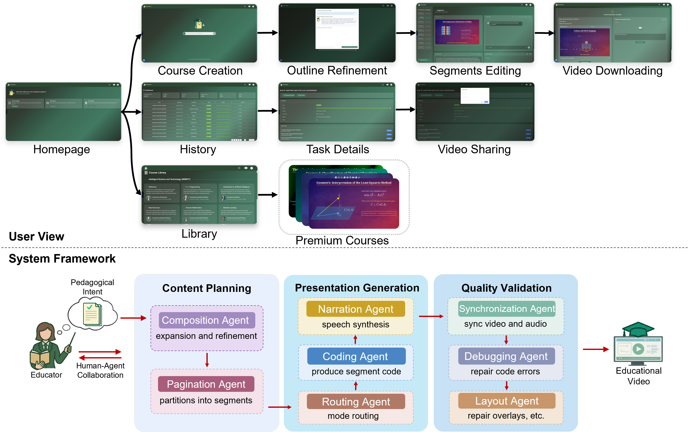
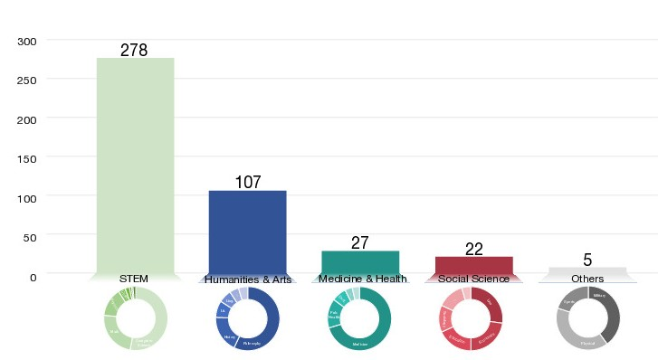

# 🎓 TeachMaster: Generative Teaching via Code

**TeachMaster** is a pioneering multi-agent framework that implements the **Generative Teaching** paradigm. By leveraging code as an intermediate semantic medium, it shifts educators from manual creators to high-level directors.


As shown in this figure, TeachMaster transforms pedagogical intents into high-quality instructional videos.

# 📚 Research Overview

## 🧠 What is Generative Teaching?
Generative Teaching (informally known as Vibe Teaching) is a novel educational paradigm that shifts the role of educators from manual content creators to high-level directors. Instead of spending hours on video editing, teachers provide high-level pedagogical intents, and the system's multi-agent framework automatically generates structured, editable, and curriculum-ready materials.

## 🚀 Core Architecture



As shown in this figure, the system architecture featuring a three-stage backend workflow: Planning, Generation, and Validation.

TeachMaster decomposes the production process into three sequential stages: Content Planning, Presentation Generation, and Quality Validation.

## 🤖 Multi-Agent Workflow
Our framework orchestrates a specialized team of agents to ensure educational rigor:

**Content Planning**:

Composition Agent: Expands raw input into a full pedagogical script.

Pagination Agent: Segment content into logical pages.

**Presentation Generation**:

Routing Agent: Selects the optimal synthesis path (Standard or Image-Augmented).

Coding Agent: Generates Manim code for rendering visual elements.

Narration Agent: Synthesizes a narration script synchronized with visual code.

**Quality Validation**:

Debugging Agent: Iteratively fixes code errors to ensure successful rendering.

Synchronization Agent: Aligns animation duration with audio length.

Layout Agent: Automatically resolves visual occlusions and layout conflicts.

## 💻 Code-Centric Representation
Unlike "black-box" pixel-level generation models, TeachMaster uses code as the intermediate semantic medium:

Precision: Eliminates visual hallucinations common in E2E models when rendering complex academic symbols.

Interpretability: Every visual element is governed by structured logic that can be traced and edited.

Efficiency: Achieves high semantic compression, requiring only ~1.21 Source Lines of Code (SLOC) per second of video.

## 🛠 Human-Agent Collaboration


Pictures above showcase the interactive refinement and template-based editing modes.

TeachMaster supports three levels of human intervention:

Interactive Optimization: Use natural language to describe changes (e.g., "Move the circle to the right"), and agents update the code.

Template-based Editing: Rapidly unify styles using pre-defined layout templates.

Direct Code Editing: Expert users can modify the Manim scripts directly for pixel-perfect control.

## 📊 Cross-Disciplinary Deployment



As shown in the figure above, TeachMaster has been deployed across 34 disciplines, including Computer Science, Quantum Physics, Abstract Algebra, Linguistics, and the Arts, demonstrating broad generalization.

# 🏗 Engineering Documentation

## 🛠 Tech Stack
**Frontend**: 
- React 18 
- Ant Design
- React Router
- React Query
- Zustand
- i18next

**Backend**:
- FastAPI
- Uvicorn
- ARQ
- Redis
- MySQL

## 📁Project Structure
```
.
├─ backend/              # FastAPI backend and ARQ worker
├─ frontend/             # React frontend
├─ docker-compose.yml    # MySQL and Redis
├─ start.sh              # Starts ARQ worker + backend
└─ README.md
```

## ⚙️ Getting Started

### Prerequisites
- Docker (for MySQL/Redis)
- Node.js and npm (for frontend)
- Python 3.8+ (for backend)

### Start Infrastructure
```bash
docker compose up -d
```

### Run Backend
Backend entry: `backend/main.py`.

There are two scripts:
- `start.sh`: runs from repo root; starts ARQ worker then FastAPI
- `backend/start.sh`: starts backend inside `backend/`

Use the one that matches your environment. Adjust conda/venv logic if needed.

### Run Frontend
```bash
cd frontend
npm install
npm start
```
Default dev URL: `http://localhost:3000` (adjust via `.env` if needed).

## 🌐Services and Ports
- Backend API: `http://localhost:8000`
- API Docs: `http://localhost:8000/docs`
- MySQL: `localhost:3306`
- Redis: `localhost:6379`

> Ports and hosts may vary with your `.env` or deployment configuration.

## 🔌Backend Routes
Routes are defined under `backend/app/api/`:
- `auth`, `content`, `course-management`
- `course-sharing`, `course-user-sharing`
- `tokens`, `tcoin`
- `admin`, `feedback`
- `health`

## 🚀Deployment Notes
- Use `docker-compose.yml` for local MySQL/Redis.
- Frontend includes `frontend/Dockerfile` and `frontend/nginx.conf`.
- Backend includes `backend/Dockerfile` for containerization.

## 🧯Troubleshooting
- Backend fails to start: verify Python deps, database connection, and Redis settings.
- ARQ worker can't connect to Redis: confirm Redis host/port alignment.
